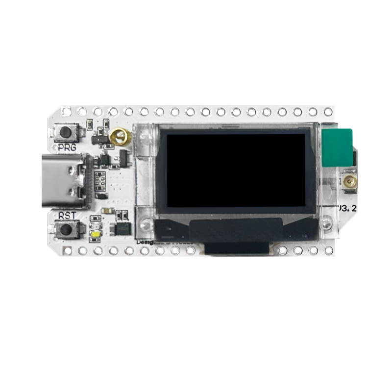

# Heltec Master LoRa – BLE NUS Monitor

<p align="center">
  
</p>

Ein modulares ESP32-Embedded-Projekt auf Basis des **Heltec WiFi LoRa 32 V3**, das per **LoRa (SX1262)** zwischen Sender und Receiver kommuniziert und per **Bluetooth Low Energy (BLE)** mit einer Flutter-Android-App konfiguriert wird. Die BLE-Kommunikation erfolgt ueber den **Nordic UART Service (NUS)** mit JSON-basiertem Protokoll.

Das Projekt unterstuetzt drei Build-Rollen:
- **Sender** – sendet periodisch Pakete per LoRa
- **Receiver** – empfaengt LoRa-Pakete mit energieeffizientem Sleep/Wake-Zyklus
- **Observer** – passiver LoRa-Sniffer auf XIAO ESP32S3 (nur Serial-Ausgabe)

---

## Inhaltsverzeichnis

1. [Projektuebersicht](#projektuebersicht)
2. [Build-Rollen (Sender / Receiver / Observer)](#build-rollen-sender--receiver--observer)
3. [Hardware](#hardware)
4. [Systemarchitektur](#systemarchitektur)
5. [LoRa-Kommunikation](#lora-kommunikation)
6. [Modulbeschreibung](#modulbeschreibung)
7. [BLE-Architektur](#ble-architektur)
8. [OLED-Display](#oled-display)
9. [Konfiguration](#konfiguration)
10. [Entwicklungsumgebung einrichten](#entwicklungsumgebung-einrichten)
11. [Build, Upload und Monitor](#build-upload-und-monitor)
12. [Projektstruktur](#projektstruktur)
13. [Ablauf (Setup / Loop)](#ablauf-setup--loop)
14. [Geplante Erweiterungen](#geplante-erweiterungen)

---

## Projektuebersicht

| Eigenschaft       | Wert                                      |
|-------------------|--------------------------------------------|
| **Projektname**   | Heltec Master                              |
| **Version**       | 0.1.0                                      |
| **Hardware**      | Heltec WiFi LoRa 32 V3 (ESP32-S3), XIAO ESP32S3 + Wio-SX1262 (Observer) |
| **Framework**     | Arduino (PlatformIO)                       |
| **LoRa**          | SX1262 via RadioLib                        |
| **BLE Stack**     | NimBLE-Arduino (h2zero)                    |
| **Display**       | SSD1306 OLED 128x64 (I2C, U8g2)           |
| **Companion App** | Flutter Android ([lora_monitor](https://github.com/jwillner/lora_monitor)) |

Das Geraet dient als:
- **LoRa Sender oder Receiver** (je nach Build-Environment)
- BLE Peripheral mit Nordic UART Service (Konfiguration)
- Echtzeit-Uhr (NTP-synchronisiert)
- OLED-Statusmonitor
- IP-basierte Geolokalisierung (via ip-api.com)

### Device

<p align="center">
  
  
  
</p>
<p align="center">
  <em>Links: Config Mode &nbsp;|&nbsp; Mitte: BLE Sync Mode &nbsp;|&nbsp; Rechts: Operational Mode (Sender + Receiver)</em>
</p>

### Flutter App ([lora_monitor](https://github.com/jwillner/lora_monitor))

<p align="center">
  
  
  
</p>
<p align="center">
  <em>Links: Main Screen &nbsp;|&nbsp; Mitte: Scan + Connect &nbsp;|&nbsp; Rechts: Device Screen</em>
</p>

---

## Build-Rollen (Sender / Receiver / Observer)

Das Projekt verwendet PlatformIO Build-Environments, um aus einer gemeinsamen Codebasis drei verschiedene Firmware-Varianten zu erzeugen:

| Environment | Rolle | Hardware | Beschreibung |
|---|---|---|---|
| `env:sender` | **Sender** | Heltec WiFi LoRa 32 V3 | Sendet alle 30s eine aufsteigende Zaehlernummer per LoRa. BLE-Name: `HeltecSender` |
| `env:receiver` | **Receiver** | Heltec WiFi LoRa 32 V3 | Empfaengt LoRa-Pakete mit intelligentem Sleep/Wake-Zyklus. BLE-Name: `HeltecReceiver` |
| `env:observer` | **Observer** | XIAO ESP32S3 + Wio-SX1262 | Passiver LoRa-Sniffer, nur Serial-Ausgabe (kein OLED, kein BLE, kein WiFi) |

Die Rolle wird ueber Build-Flags gesteuert (`-DROLE_SENDER=1`, `-DROLE_RECEIVER=1`, `-DROLE_OBSERVER=1`).

### Sender
- Startet nach BLE-Konfiguration den LoRa-Sendebetrieb
- Sendet alle `LORA_SEND_INTERVAL_MS` (30s) ein Paket mit einer aufsteigenden Nummer
- Zeigt auf dem OLED den TX-Status und Countdown bis zum naechsten Senden

### Receiver
- Startet nach BLE-Konfiguration im LoRa-Empfangsmodus
- Hat eine dreiteilige Zustandsmaschine fuer energieeffizientes Empfangen:
  1. **INITIAL_SYNC** – hoert dauerhaft, bis das erste Paket empfangen wird (lernt den Sendetakt)
  2. **SLEEPING** – geht in ESP32 Light-Sleep bis kurz vor dem naechsten erwarteten Paket
  3. **LISTENING** – oeffnet ein Empfangsfenster (`LORA_RX_WINDOW_MS` = 10s) und wartet auf das Paket
- Bei verpasstem Paket (Timeout) wird das naechste Fenster frueher geoeffnet (`LORA_RX_MISS_EXTRA_MS`)
- Zeigt RSSI und SNR des empfangenen Signals auf dem OLED an

### Observer
- Minimaler LoRa-Sniffer ohne weitere Peripherie
- Gibt empfangene Pakete mit Zeitstempel, RSSI und SNR auf Serial aus
- Laeuft auf separater Hardware (XIAO ESP32S3 mit Wio-SX1262 Board-to-Board)

---

## Hardware

### Heltec WiFi LoRa 32 V3 (Sender / Receiver)

| Komponente   | Details                        |
|-------------|--------------------------------|
| MCU         | ESP32-S3                       |
| OLED        | SSD1306, 128x64, I2C           |
| BLE         | Integriert (NimBLE Stack)      |
| WiFi        | 802.11 b/g/n (fuer NTP + Geolokalisierung) |
| LoRa        | SX1262 (868 MHz, SF7, BW 125 kHz) |

### XIAO ESP32S3 + Wio-SX1262 (Observer)

| Komponente   | Details                        |
|-------------|--------------------------------|
| MCU         | ESP32-S3 (Seeed XIAO)          |
| LoRa        | Wio-SX1262 (B2B, 868 MHz)      |
| TCXO        | 1.8V                           |
| Antenna SW  | GPIO 38                        |

### Pin-Belegung (Heltec V3)

| Funktion     | GPIO |
|-------------|------|
| OLED SDA    | 17   |
| OLED SCL    | 18   |
| OLED Reset  | 21   |
| Vext (OLED Power) | 36 |
| LoRa NSS    | SS (8)  |
| LoRa DIO1   | DIO0 (14) |
| LoRa RST    | RST_LoRa (12) |
| LoRa BUSY   | BUSY_LoRa (13) |

> **Vext** steuert die Stromversorgung des OLED-Displays. Active LOW: `LOW` = Ein, `HIGH` = Aus.

---

## Systemarchitektur

```
+------------------+        LoRa 868 MHz       +------------------+
|  Heltec Sender   | ----------------------->  |  Heltec Receiver |
|  (env:sender)    |    Pakete alle 30s         |  (env:receiver)  |
+------------------+                            +------------------+
        |                                               |
        |--- BLE (NUS) <--> Flutter App                 |--- BLE (NUS) <--> Flutter App
        |                                               |
        |--- Board       (Hardware-Init)                |--- Board       (Hardware-Init)
        |--- Logger      (Circular Log Buffer)          |--- Logger      (Circular Log Buffer)
        |--- Ui          (OLED Rendering)               |--- Ui          (OLED Rendering)
        |--- TimeSvc     (WiFi + NTP Sync)              |--- TimeSvc     (WiFi + NTP Sync)
        |--- BleSvc      (BLE NUS Server)               |--- BleSvc      (BLE NUS Server)
        |--- LoRaSvc     (SX1262 TX)                    |--- LoRaSvc     (SX1262 RX)
        +--- GeoSvc      (IP-Geolokalisierung)          +--- GeoSvc      (IP-Geolokalisierung)

Observer (env:observer):
+------------------+
|  XIAO ESP32S3    |    nur LoRaSvc + Serial
|  + Wio-SX1262    |    (kein BLE/WiFi/OLED)
+------------------+
```

Die Module sind voneinander entkoppelt und kommunizieren ueber klar definierte Schnittstellen. Die zentrale Konfiguration erfolgt in `include/config.h` ueber `#define`-Makros.

---

## LoRa-Kommunikation

### Uebersicht

Sender und Receiver kommunizieren ueber LoRa (SX1262, 868 MHz). Der Sender sendet periodisch (alle 30 Sekunden) ein Paket mit einer aufsteigenden Nummer. Der Receiver empfaengt dieses Paket und synchronisiert seinen Sleep/Wake-Zyklus darauf.

```
+------------------+        LoRa 868 MHz        +------------------+
|  Heltec Sender   | ----------------------->   |  Heltec Receiver |
|  (env:sender)    |    Paket alle 30s           |  (env:receiver)  |
+------------------+                             +------------------+
                                                         |
                                  +----------------------+
                                  |
                           +------v-----------+
                           |  Observer         |
                           |  (XIAO + SX1262) |
                           |  passiv mithören  |
                           +------------------+
```

### LoRa-Parameter

| Parameter | Wert |
|---|---|
| Frequenz | 868.0 MHz (EU) |
| Bandbreite | 125.0 kHz |
| Spreading Factor | 7 |
| Coding Rate | 4/5 |
| Sync Word | 0x12 |
| TX Power | 14 dBm |
| Preamble Length | 8 |
| TCXO | 1.6V (Heltec V3), 1.8V (Wio-SX1262) |

### Receiver Sleep/Wake-Zyklus

Der Receiver nutzt ESP32 Light-Sleep, um zwischen den erwarteten Paketen Strom zu sparen:

```
Zustandsmaschine:

  INITIAL_SYNC ──(erstes Paket empfangen)──> SLEEPING
       ^                                        |
       |                              (Aufwachen vor erwartetem Paket)
       |                                        v
       |                                    LISTENING
       |                                     /     \
       |                    (Paket empfangen)/       \(Timeout)
       |                                   v         v
       |                               SLEEPING   SLEEPING
       |                                          (frueheres Fenster)
```

| Parameter | Wert | Beschreibung |
|---|---|---|
| `LORA_SEND_INTERVAL_MS` | 30000 ms | Sendeintervall Sender |
| `LORA_RX_GUARD_MS` | 5000 ms | Aufwachzeit vor erwartetem Paket |
| `LORA_RX_WINDOW_MS` | 10000 ms | Dauer des Empfangsfensters |
| `LORA_RX_MISS_EXTRA_MS` | 5000 ms | Zusaetzliche Vorlaufzeit nach Paketverlust |

### BLE-Konfigurationsmodus

Beide Geraete (Sender und Receiver) starten im **CONFIG MODE**. In diesem Modus ist nur BLE aktiv. LoRa wird erst gestartet, nachdem eine gueltige Konfiguration per BLE (`set_config`) empfangen wurde. Dies ermoeglicht:
- Zuweisung von Seriennummer und Device-ID
- Auswahl des Betriebsmodus
- Spaeterer Start des LoRa-Betriebs ohne Neustart

---

## Modulbeschreibung

### Board (`lib/Board/`)

Hardware-Abstraktionsschicht fuer den Heltec-Board-spezifischen Init-Prozess.

| Funktion              | Beschreibung                               |
|-----------------------|--------------------------------------------|
| `Board::vextOn()`     | Aktiviert Vext (OLED-Stromversorgung)      |
| `Board::oledResetPulse()` | Reset-Puls fuer das OLED (LOW-HIGH)    |
| `Board::i2cBeginForOled()` | Initialisiert I2C-Bus (SDA/SCL/Clock) |

### Logger (`lib/Logger/`)

Ringpuffer-basiertes Logging-System. Schreibt gleichzeitig auf Serial und in einen RAM-Buffer.

| Methode                    | Beschreibung                                    |
|----------------------------|-------------------------------------------------|
| `Logger(size_t lines)`     | Konstruktor, legt Puffergroesse fest (default: 3)|
| `begin(uint32_t baud)`     | Initialisiert Serial mit angegebener Baudrate    |
| `log(const String& s)`     | Loggt Nachricht auf Serial + Ringpuffer          |
| `count()`                  | Anzahl aktuell gespeicherter Zeilen              |
| `getOldestFirst(size_t i)` | Gibt i-te Zeile in FIFO-Reihenfolge zurueck      |

Der Ringpuffer speichert die letzten **3 Zeilen** (konfigurierbar via `LOGGER_LINES`), was fuer die OLED-Anzeige optimiert ist.

### TimeSvc (`lib/TimeSvc/`)

Einmalige Zeitsynchronisation: WiFi verbinden, NTP abrufen, WiFi trennen.

| Funktion                                | Beschreibung                              |
|-----------------------------------------|-------------------------------------------|
| `TimeSvc::valid()`                      | Prueft ob Systemzeit > Epoch-Schwelle     |
| `TimeSvc::formatHHMMSS(buf, len)`       | Formatiert aktuelle Zeit als `HH:MM:SS`   |
| `TimeSvc::syncOnce(ssid, pass, tz, fn)` | Einmalige WiFi+NTP Synchronisation        |

**Ablauf von `syncOnce`:**
1. WiFi im STA-Modus verbinden (Timeout: 12 Sekunden)
2. Zeitzone setzen (`TZ_INFO`)
3. NTP-Server abfragen (3 Server konfiguriert)
4. Warten auf gueltige Zeit (Timeout: 12 Sekunden)
5. WiFi trennen und deaktivieren

### Ui (`lib/Ui/`)

OLED-Display-Rendering ueber die U8g2-Bibliothek.

| Methode                                   | Beschreibung                        |
|-------------------------------------------|-------------------------------------|
| `Ui(int rstPin)`                          | Konstruktor mit Reset-Pin           |
| `begin()`                                 | Initialisiert Display               |
| `render(const char* timeStr, Logger& log)`| Zeichnet komplettes Display-Layout  |

**Display-Layout (128x64 Pixel):**

```
+----------------------------+
| Heltec Master              |   <- Titel (6x12 Font)
|                            |
|   14:32:07                 |   <- Uhrzeit (Logisoso18 Font)
|----------------------------|   <- Trennlinie (y=40)
| Log Zeile 1                |   <- Aeltester Eintrag
| Log Zeile 2                |
| Log Zeile 3                |   <- Neuester Eintrag
+----------------------------+
```

### LoRaSvc (`lib/LoRaSvc/`)

LoRa-Abstraktionsschicht auf Basis von RadioLib (SX1262). Unterstuetzt Senden und interrupt-basiertes Empfangen.

| Funktion | Beschreibung |
|---|---|
| `LoRaSvc::begin(logFn)` | Initialisiert SX1262 mit Parametern aus `config.h` |
| `LoRaSvc::sendString(msg)` | Sendet einen String per LoRa |
| `LoRaSvc::send(data, len)` | Sendet Rohdaten per LoRa |
| `LoRaSvc::startReceive()` | Startet Empfangsmodus (interrupt-basiert) |
| `LoRaSvc::available()` | Prueft ob ein Paket empfangen wurde |
| `LoRaSvc::readString()` | Liest empfangenes Paket als String |
| `LoRaSvc::lastRssi()` | RSSI des letzten empfangenen Pakets (dBm) |
| `LoRaSvc::lastSnr()` | SNR des letzten empfangenen Pakets (dB) |

### GeoSvc (`lib/GeoSvc/`)

IP-basierte Geolokalisierung ueber ip-api.com (kein API-Key noetig). Wird waehrend der WiFi-Synchronisation abgerufen.

| Funktion | Beschreibung |
|---|---|
| `GeoSvc::fetchOnce(logFn)` | Ruft Position einmalig per HTTP ab |
| `GeoSvc::lat()` / `GeoSvc::lng()` | Breitengrad / Laengengrad |
| `GeoSvc::valid()` | Prueft ob gueltige Position vorhanden |
| `GeoSvc::position()` | Gibt Position als `"lat,lng"` String zurueck |

### BleSvc (`lib/BleSvc/`)

BLE-Peripheral mit Nordic UART Service (NUS). Empfaengt JSON-Befehle und sendet JSON-Antworten.

| Methode                 | Beschreibung                                |
|-------------------------|---------------------------------------------|
| `BleSvc::begin(Logger&)`| Initialisiert BLE, startet NUS + Advertising|

**Unterstuetzte Befehle:**

| Befehl (RX)                    | Antwort (TX)                                |
|-------------------------------|---------------------------------------------|
| `{"cmd":"get_info"}`          | `{"devicename":"...","serial":"...","battery":87,"position":"...","brightness":60,"temperature":23.4}` |
| Unbekannter Befehl            | `{"error":"unknown_cmd"}`                   |

**BLE-Details:**
- TX Power: `ESP_PWR_LVL_P9` (Maximum)
- Advertising Interval: 100ms (konfigurierbar)
- Security: Keine Authentifizierung (Open Pairing)
- Auto-Reconnect: Advertising startet automatisch nach Disconnect
- RX-Buffer: Max. 512 Bytes pro Zeile

---

## BLE-Architektur

### Rollen

| Komponente | BLE-Rolle  | GATT-Rolle  |
|-----------|------------|-------------|
| Heltec    | Peripheral | GATT Server |
| App       | Central    | GATT Client |

### Nordic UART Service (NUS) UUIDs

```
Service:  6E400001-B5A3-F393-E0A9-E50E24DCCA9E
RX Char:  6E400002-B5A3-F393-E0A9-E50E24DCCA9E  (Write / Write No Response)
TX Char:  6E400003-B5A3-F393-E0A9-E50E24DCCA9E  (Notify)
```

> **RX** = Daten von App an Device (Write)
> **TX** = Daten von Device an App (Notify)

### Advertising-Strategie

| Feld              | Inhalt              | Grund                                  |
|-------------------|---------------------|----------------------------------------|
| Primary Adv.      | NUS Service UUID    | Ermoeglicht gezielten Scan nach Service|
| Scan Response     | Device Name         | Android zeigt Namen zuverlaessig an    |

Die Trennung vermeidet Payload-Overflow im 31-Byte Primary Advertising.

---

## OLED-Display

- **Controller:** SSD1306
- **Aufloesung:** 128 x 64 Pixel
- **Interface:** I2C (Adresse `0x3C`)
- **Bibliothek:** U8g2 (Vollbild-Buffer-Modus)
- **Fonts:** `u8g2_font_6x12_tf` (Text), `u8g2_font_logisoso18_tf` (Uhrzeit)
- **Refresh:** ca. 20 FPS (50ms Loop-Delay)

---

## Konfiguration

Alle Einstellungen befinden sich in `include/config.h`:

### Feature Toggles

```cpp
#define WIFI_ENABLED  1    // 0 = WiFi/NTP deaktiviert
#define BLE_ENABLED   1    // 0 = BLE deaktiviert
#define LORA_ENABLED  1    // 0 = LoRa deaktiviert
#define GEO_ENABLED   1    // 0 = Geolokalisierung deaktiviert
```

> Der Observer ueberschreibt diese Defaults: nur `LORA_ENABLED=1`, alles andere deaktiviert.

### WiFi / NTP

```cpp
#define WIFI_SSID       "DEIN_SSID"
#define WIFI_PASSWORD   "DEIN_PASSWORT"
#define TZ_INFO         "CET-1CEST,M3.5.0/2,M10.5.0/3"  // Mitteleuropa
#define NTP_SERVER_1    "pool.ntp.org"
#define NTP_SERVER_2    "time.nist.gov"
#define NTP_SERVER_3    "europe.pool.ntp.org"
```

### BLE

```cpp
#define BLE_DEVICE_NAME      "HeltecMaster"
#define BLE_ADV_INTERVAL_MS  100   // Advertising-Intervall (ms)
```

### Hardware Pins

```cpp
#define OLED_I2C_SDA    17
#define OLED_I2C_SCL    18
#define OLED_RST_PIN    21
#define VEXT_CTRL_PIN   36
```

> **Wichtig:** Vor dem Commit eigene WiFi-Zugangsdaten durch Platzhalter ersetzen!

---

## Entwicklungsumgebung einrichten

### Voraussetzungen

- Python 3.x
- Git

### 1. Repository klonen

```bash
git clone https://github.com/jwillner/heltec_master_lora.git
cd heltec_master_lora
```

### 2. Python Virtual Environment erstellen

**Windows (PowerShell):**

```powershell
python -m venv .venv
.\.venv\Scripts\Activate.ps1
python -m pip install --upgrade pip
pip install -r requirements.txt
```

> Falls `Activate.ps1` blockiert wird:
> ```powershell
> Set-ExecutionPolicy -Scope CurrentUser RemoteSigned
> ```

**Linux / macOS:**

```bash
python3 -m venv .venv
source .venv/bin/activate
pip install --upgrade pip
pip install -r requirements.txt
```

### 3. PlatformIO verifizieren

```bash
pio --version
```

---

## Build, Upload und Monitor

```bash
# Sender kompilieren und flashen
pio run -e sender -t upload && pio device monitor -b 115200

# Receiver kompilieren und flashen
pio run -e receiver -t upload && pio device monitor -b 115200

# Observer kompilieren und flashen (XIAO ESP32S3)
pio run -e observer -t upload && pio device monitor -b 115200

# Nur kompilieren (alle Environments)
pio run

# Nur ein Environment kompilieren
pio run -e sender
```

---

## Projektstruktur

```
heltec_master_lora/
|
|-- include/
|   |-- config.h                 # Zentrale Konfiguration (Pins, WiFi, BLE, LoRa, NTP)
|   +-- Lora_Kommunikation.md   # FSD: LoRa Master-Client Timeslot-Protokoll (v0.1)
|
|-- src/
|   +-- main.cpp                 # Einstiegspunkt (setup + loop, Sender/Receiver/Observer)
|
|-- lib/
|   |-- Board/src/
|   |   |-- Board.h              # Hardware-Init Interface
|   |   +-- Board.cpp            # Vext, I2C, OLED Reset
|   |
|   |-- Logger/src/
|   |   |-- Logger.h             # Ringpuffer-Logger Interface
|   |   +-- Logger.cpp           # Serial + RAM Logging
|   |
|   |-- Log/src/
|   |   |-- Log.h                # Alternative LogRing Template-Klasse
|   |   +-- Log.cpp
|   |
|   |-- TimeSvc/src/
|   |   |-- TimeSvc.h            # NTP-Sync Interface
|   |   +-- TimeSvc.cpp          # WiFi connect, NTP sync, WiFi disconnect
|   |
|   |-- Ui/src/
|   |   |-- Ui.h                 # OLED Display Interface
|   |   +-- Ui.cpp               # U8g2 Rendering (Titel, Uhrzeit, LoRa-Status)
|   |
|   |-- LoRaSvc/src/
|   |   |-- LoRaSvc.h            # LoRa SX1262 Interface (TX + RX)
|   |   +-- LoRaSvc.cpp          # RadioLib-basiert, interrupt-gesteuerter Empfang
|   |
|   |-- GeoSvc/src/
|   |   |-- GeoSvc.h             # Geolokalisierung Interface
|   |   +-- GeoSvc.cpp           # IP-basiert via ip-api.com
|   |
|   +-- BleSvc/src/
|       |-- BleSvc.h             # BLE NUS Interface
|       |-- BleSvc.cpp           # NimBLE Server, NUS, JSON Commands
|       +-- specification.md     # BLE-Spezifikation (Deutsch)
|
|-- platformio.ini               # PlatformIO Build-Konfiguration (sender/receiver/observer)
|-- requirements.txt             # Python-Abhaengigkeiten (platformio)
|-- .gitignore                   # Git: ignoriert .pio, .venv, .vscode
+-- README.md                    # Diese Datei
```

---

## Ablauf (Setup / Loop)

### Setup-Phase (Sender / Receiver)

```
1. Logger initialisieren (Serial 115200 Baud)
2. Board::vextOn()          -> OLED-Stromversorgung aktivieren
3. Board::oledResetPulse()  -> OLED zuruecksetzen
4. Board::i2cBeginForOled() -> I2C-Bus starten
5. Ui::begin()              -> Display initialisieren
6. BleSvc::begin()          -> BLE + NUS starten (wenn BLE_ENABLED)
7. WiFi -> NTP-Sync -> GeoSvc::fetchOnce() -> WiFi aus (wenn WIFI_ENABLED)
8. CONFIG MODE              -> Warten auf BLE set_config Befehl
```

### Loop-Phase – CONFIG MODE

```
Solange keine BLE-Konfiguration empfangen:
  -> Display zeigt "CONFIG MODE – Waiting for BLE..."
  -> Kein LoRa, kein Sleep
```

### Loop-Phase – Sender (nach Konfiguration)

```
1. LoRaSvc::begin()         -> SX1262 initialisieren (einmalig)
2. Alle 30s: LoRaSvc::sendString(counter) -> Paket senden
3. Periodisch: WiFi-Sync (NTP + Geo) alle 5 Minuten
4. Ui::render()             -> Display: Uhrzeit, Position, TX-Status, Countdown
5. delay(50ms)
```

### Loop-Phase – Receiver (nach Konfiguration)

```
1. LoRaSvc::begin() + startReceive()  -> SX1262 in RX-Modus (einmalig)
2. Zustandsmaschine:
   INITIAL_SYNC: Dauerhaftes Empfangen bis erstes Paket ankommt
   SLEEPING:     Light-Sleep bis LORA_RX_GUARD_MS vor erwartetem Paket
   LISTENING:    Empfangsfenster offen (max LORA_RX_WINDOW_MS)
                 -> Paket empfangen: zurueck zu SLEEPING
                 -> Timeout: SLEEPING mit frueherem Fenster
3. Periodisch: WiFi-Sync (NTP + Geo) alle 5 Minuten
4. Ui::render()             -> Display: Uhrzeit, Position, RX-Status, RSSI
5. delay(50ms)
```

### Setup/Loop – Observer

```
Setup:
  1. Serial.begin()
  2. LoRaSvc::begin() + startReceive()

Loop:
  1. Heartbeat: "." jede Sekunde auf Serial
  2. Bei Paketempfang: Ausgabe mit Paketnummer, Zeitstempel, RSSI, SNR
```

---

## Geplante Erweiterungen

- LoRa Master-Client Timeslot-Protokoll (siehe `include/Lora_Kommunikation.md`)
- Erweiterte BLE-Befehle (Steuerung, Konfiguration)
- Flutter-App als vollstaendiger BLE-Monitor und Controller
- Batterieueberwachung und Energiesparmodi
- OTA-Updates ueber BLE oder WiFi
- Echtdaten statt Dummy-Werte (Temperatur, Luftfeuchtigkeit)

---

## Abhaengigkeiten

| Bibliothek           | Version   | Zweck                    |
|---------------------|-----------|--------------------------|
| U8g2                | >= 2.36.17| OLED-Display (SSD1306)   |
| NimBLE-Arduino      | latest    | BLE Stack (h2zero Fork)  |
| ArduinoJson         | >= 7.0.0  | JSON-Parsing (BLE-Befehle) |
| RadioLib            | >= 7.0.0  | LoRa SX1262 Treiber      |
| PlatformIO Core     | >= 6.x    | Build-System             |

---

## Lizenz

Dieses Projekt ist derzeit ohne explizite Lizenz. Fuer Fragen zur Nutzung bitte den Autor kontaktieren.
